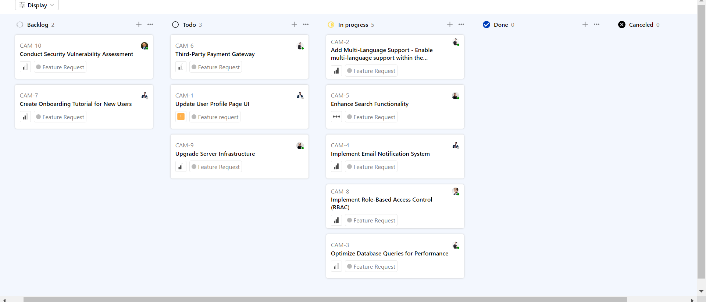
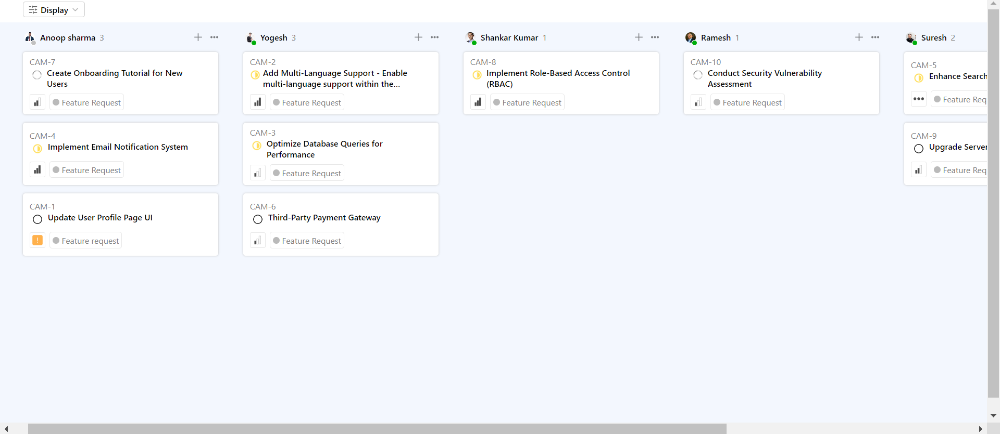
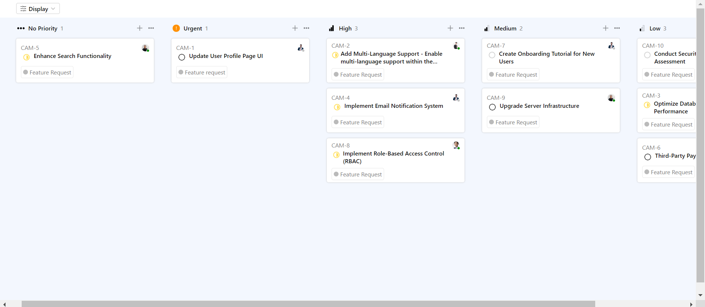
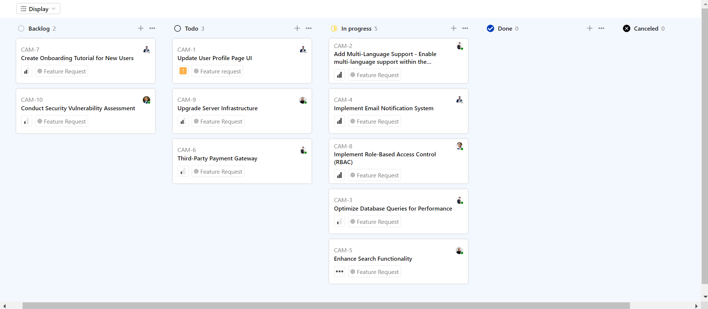
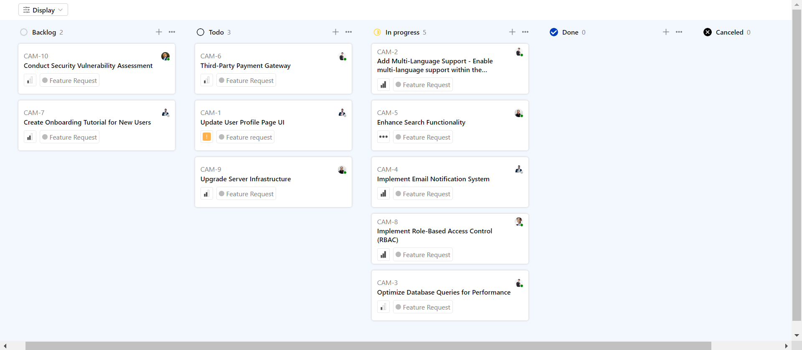

# Kanban Board React App

Welcome to my Kanban Board React App repository! The goal of this application is to interact with the provided API and display the data in a dynamic Kanban board format based on user preferences. When a user clicks the "display" button and selects a grouping or ordering option, the Kanban board should dynamically adjust to reflect the user's choice.
The Deployed app can be seen here [Kanbann Board](https://kanban-board-ei5ybh1o2-parashuram-78.vercel.app/).
## Before You Begin
Before you begin we recommend you read about the basic building blocks that assemble my Quicksell project:
* React.js - A JavaScript library for building user interfaces build by Facebook. Go through [React official website](https://reactjs.org/) and proceed to their [documntations](https://reactjs.org/docs/getting-started.html) and [tutorials](https://reactjs.org/tutorial/tutorial.html), which should help you understand the React Framework easily.

## Prerequisites
Make sure you have installed all of the following prerequisites on your development machine:
* Git - [Download & Install Git](https://git-scm.com/downloads). OSX and Linux machines typically have this already installed.
* VS Code - [Download & Install VS Code](https://code.visualstudio.com/download), one of the most popular code - editor developed by Microsoft.
* Node.js - [Download & Install Node.js](https://nodejs.org/en/download/) and the npm package manager. If you encounter any problems, you can also use this [GitHub Gist](https://gist.github.com/isaacs/579814) to install Node.js.


## Downloading the Quicksell - Project
There are several ways you can get the Quicksell - Project boilerplate:

### Cloning The GitHub Repository
The recommended way to get the Quicksell - Project is to use git to directly clone the Quicksell - Project repository:

1. Fork the repository to your own account.
2. Run the following command in the terminal to clone the repository

```bash
$ git clone https://github.com/<Your-Github-Name >/Kanban-Board.git 
```


### Downloading The Repository Zip File
Another way to use the Quicksell - Project boilerplate is to download a zip copy from the [main branch on GitHub](https://github.com/Parashuram-78/Kanban-Board) by clicking on the Code button and then click on Download ZIP


## Get Started
Once you've downloaded the boilerplate and installed all the prerequisites, you're just a few steps away from starting to run my Quicksell - project

- Open the Quicksell folder in VS Code.

- Open a new terminal by clicking the command (Ctrl + Shift + `) or clicking on **Terminal -> New Terminal** in the navigation menu

- To install the dependencies, run this in the application folder from the command-line:
    ```bash
    npm install
    ```

- To run the react - app, run the following command
     ```bash
    npm start
    ```
- Open your web browser and visit [http://localhost:3000](http://localhost:3000) to access the Kanban board application.


### Grouping Options

The application offers three distinct ways to group the data:

1. **By Status**: Group tickets based on their current status.

2. **By User**: Arrange tickets according to the assigned user.

1. **By Priority**: Group tickets based on their priority level.


### Ordering Options

Users can also sort the displayed tickets in two ways:

1. **Priority**: Arrange tickets in descending order of priority.

1. **Title**: Sort tickets in ascending order based on their title.


### Visual Design

The Kanban board is responsive and visually appealing, with a design similar to the provided screenshots.

### Priority Levels

The priority levels for the tickets are as follows:

- Urgent (Priority level 4)
- High (Priority level 3)
- Medium (Priority level 2)
- Low (Priority level 1)
- No priority (Priority level 0)


### Persistence

Additionally, I ensured that the application saves the user's view state even after a page reload.

### Assets

For icons, I used icons from various sources, including Google and other libraries.

### Restrictions

I followed the provided guidelines strictly:

1. I didn't use CSS libraries like Tailwind, Vite, Material UI, Chakra, etc.
2. I didn't use Next.js or similar frameworks. I coded the application in pure ReactJS.
